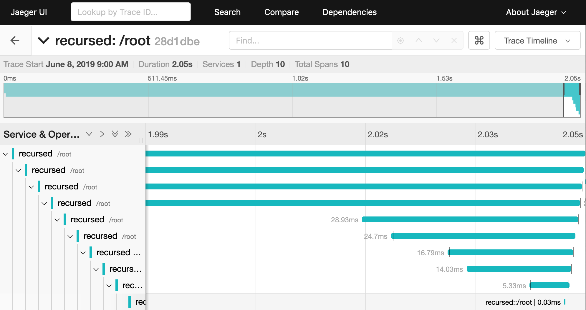
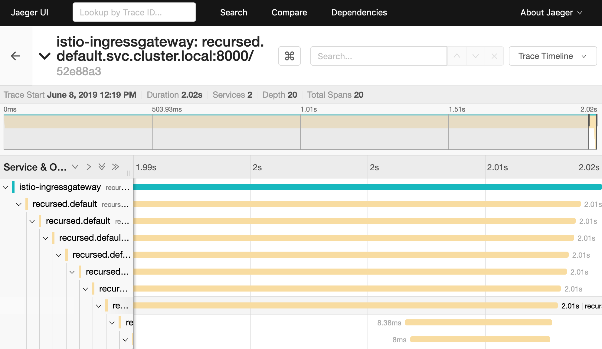

# recursed

A recursing microservice to demonstrate OpenTracing with one-only
service and `jaegertracing/all-in-one` or `Istio`

## Using recursed with jaegertracing/all-in-one

This demonstration is based on a simple `docker-compose.yaml` file. The
associated resources are all available in the project directory and on
docker hub
[gregoryguillou/recursed](https://cloud.docker.com/u/gregoryguillou/repository/docker/gregoryguillou/recursed).

For a quick start, you can download the `docker-compose.yml` file and
run `docker-compose up`. You should be able:

- To run a test with `curl` and the command below:

```shell
curl -v 0.0.0.0:8000/ -d '{"value": 6}' \
  -XPOST -H 'Content-Type: application/json'
```

- To access UI, open this [url](http://localhost:16686/)



If you want to know more, visit
[the associated article on my blog](https://gregoryguillou.github.io/2019-06/hint-opentracing)

## Using recursed with Istio

The `-istio` flag allows to use `recursed` with the Istio Envoy-based tracing
that relies on B3/Zipkin headers as well as the `x-request-id` header. Once
you've installed Istio with Jaeger or Zipkin, deploy the `recursed-istio.yml`
manifest. It includes a sample gateway, a virtual service, a service and
a deployment for a whole test.

- To run a command with curl, get the gataway URL which depends on your
  Kubernetes setup and the service named `istio-ingressgateway` located in
  the `istio-system` namespace. For instance on AWS, assuming the service
  relies on a loadbalancer, you should get it with the command below. Adapt
  the `--ouput`or `-o` to your requirements:

```shell
kubectl get svc -n istio-system istio-ingressgateway \
  -o jsonpath='{.status.loadBalancer.ingress[0].hostname}'
  
export GW=$(kubectl get svc -n istio-system istio-ingressgateway \
  -o jsonpath='{.status.loadBalancer.ingress[0].hostname}')
```

- You should be able to run a `curl` command like the one below:

```shell
curl -v $GW/ -d '{"value": 6}' \
  -X POST  -H 'Content-Type: application/json'
```

- Connect to your jaeger instance with a `port-forward` command and opening
  with your browser on this [url](http://localhost:16686):

```shell
kubectl port-forward -n istio-system \
  $(kubectl get pod -n istio-system \
       -l app=jaeger \
       -o jsonpath='{.items[0].metadata.name}') 16686:16686  &
```



> Note: In order for Jaeger to work, you should first have a service and a pod
> running with Istio so that Pilot can be started and configure the OpenTracing
> service based on the feedback it gets. You will not be able to access Jaeger
> and will get errors like the ones below before you start an application in
> Istio:

```text
[2023-06-06 07:14:07.567][13][warning][config] [bazel-out/k8-opt/bin/external/envoy/source/common/config/_virtual_includes/grpc_stream_lib/common/config/grpc_stream.h:86] gRPC config stream closed: 14, upstream connect error or disconnect/reset before headers. reset reason: connection failure
2023-06-06T07:14:09.419199Z	info	Envoy proxy is NOT ready: config not received from Pilot (is Pilot running?): cds updates: 0 successful, 0 rejected; lds updates: 0 successful, 0 rejected
[...]
```

